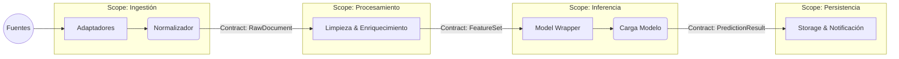

# Manifiesto de Arquitectura: Skema

Este documento define las reglas inquebrantables del sistema, los contratos de datos y el flujo canónico para garantizar escalabilidad y mantenibilidad.

## 1. Diagrama Lógico del Pipeline

El sistema sigue un patrón de **Tuberías y Filtros (Pipes and Filters)** unidireccional. La información fluye en una sola dirección; nunca retrocede.

---

## 2. Matriz de Responsabilidades y Prohibiciones

Para evitar la deuda técnica, cada módulo tiene límites estrictos ("Hard Boundaries").

### 🟢 Módulo: `ingestion/`

- **Responsabilidad:** Actuar como **traductor universal**. Recibe ruido exterior y emite `RawDocument`.
- **✅ SÍ HACE:** Validación de estructura JSON, generación de `trace_id`, manejo de errores de conexión con fuentes.
- **❌ NO HACE:** Limpieza de texto (eso es preprocessing), consultas a base de datos de negocio, lógica de clasificación.

### 🔵 Módulo: `preprocessing/`

- **Responsabilidad:** Higiene de datos.
- **✅ SÍ HACE:** Regex, tokenización, truncado de texto, conversión de formatos.
- **❌ NO HACE:** Llamadas a APIs externas (debe ser puro y rápido), acceso a BD.

### 🟣 Módulo: `inference/`

- **Responsabilidad:** Oráculo Stateless.
- **✅ SÍ HACE:** Cargar artefactos de modelos (.pkl, .onnx), operaciones matriciales.
- **❌ NO HACE:** Entrenar modelos (eso es offline), decidir qué hacer con una predicción de baja confianza (eso es lógica de negocio/storage).

### 🟠 Módulo: `storage/`

- **Responsabilidad:** Memoria y Reacción.
- **✅ SÍ HACE:** Guardar log de auditoría completo, gatillar webhooks, actualizar estado en BD.
- **❌ NO HACE:** Modificar la predicción original.

---

## 3. Estrategia de Escalabilidad

1.  **Nuevas Fuentes:** Se crea un nuevo adaptador en `ingestion/adapters/`. El resto del sistema ni se entera.
2.  **Nuevos Modelos:** Se añade un archivo de modelo en `inference/models/` y se actualiza la configuración. El contrato `FeatureSet` se mantiene.
3.  **Mayor Volumen:** Gracias al desacoplamiento, podemos insertar una **Cola de Mensajes** (RabbitMQ/Redis) entre `Ingestion` y `Preprocessing` sin reescribir la lógica de los módulos. La API de ingesta simplemente "encola y olvida".
