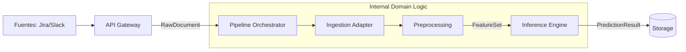

# Skema

> **Intelligent Requirement Classification System**

  

## 🔭 Visión del Proyecto

Skema es un sistema de ingeniería de datos diseñado para **automatizar la clasificación de requerimientos entrantes** en equipos de ingeniería de alto volumen.

El problema que resuelve es la fricción cognitiva que genera clasificar manualmente miles de tickets. Skema ingesta flujos de información no estructurada (Jira, Slack, Email), los procesa mediante ML y entrega un backlog estructurado.

**Diseñado para:**

- **Escalabilidad:** Procesar altos volúmenes mediante una arquitectura de pipeline desacoplado.
- **Gobernanza:** Flujo de datos estricto basado en contratos inmutables.
- **Extensibilidad:** Agregar nuevas fuentes o modelos sin refactorizar el núcleo.

---

## 🏗 Arquitectura y Diseño

Skema implementa una arquitectura de **Pipeline Canónico Orientado a Eventos**.
Abandonamos el monolito tradicional en favor de un diseño de **Pipes and Filters** unidireccional.

### Principios Fundamentales

1.  **Contracts First:** Nada se mueve entre módulos sin un esquema de datos (DTO) definido.
2.  **API como Gateway:** La API es un adaptador "tonto". Solo valida, encola y responde. No contiene lógica de ML.
3.  **Observabilidad Sidecar:** Las métricas y logs envuelven la lógica sin contaminarla.

### Flujo Canónico End-to-End



1.  **Ingestion:** Normaliza inputs externos al contrato `RawDocument`.
2.  **Preprocessing:** Limpieza determinista y extracción de features (`FeatureSet`).
3.  **Inference:** Oráculo stateless. Aplica el modelo activo y emite `PredictionResult`.
4.  **Storage:** Persistencia de traza completa y notificación.

---

## 🛠 Estructura del Proyecto

Seguimos el patrón de "Screaming Architecture". La estructura comunica la intención del sistema.

```text
skema/
├── contracts/          # La Ley. Schemas Pydantic compartidos e inmutables.
├── cmd/                # Puntos de entrada (API Server, Worker, CLI).
├── internal/           # Lógica de Negocio Privada.
│   ├── ingestion/      # Adaptadores de fuentes.
│   ├── preprocessing/  # Funciones puras de limpieza.
│   ├── inference/      # Estrategias de modelos ML.
│   └── pipeline/       # Orquestador del flujo.
├── pkg/                # Utilidades compartidas (Logger, Metrics).
└── deploy/             # Docker Compose e Infraestructura.
```

---

## 🚀 Guía Rápida

### Prerrequisitos

- Docker & Docker Compose
- Python 3.11+

### Ejecución Local

Levanta todo el stack (API + Redis + Worker Mock):

```bash
docker-compose up -d --build
```

### Ingestar un requerimiento de prueba

```bash
curl -X POST http://localhost:8000/api/v1/ingest \
  -H "Content-Type: application/json" \
  -d '{"source": "ticket", "content": "El login falla con 500", "metadata": {}}'
```

---

## 🗺 Roadmap Técnico

- [ ] **v0.1:** Definición de Arquitectura y Contratos Base (Actual).
- [ ] **v0.2:** Implementación del Skeleton (FastAPI + Orquestador Síncrono).
- [ ] **v0.3:** Integración de "Dummy Model" y Logging Estructurado.
- [ ] **v1.0:** Soporte asíncrono completo (Colas) y Persistencia DB.
